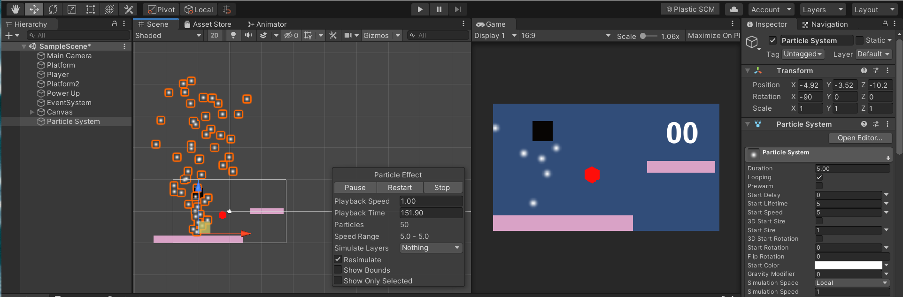

# Unity Particle Effects 2D

## Introduction

✨Particle effects are nothing but just like the phrase that says, *the* *cherry on the cake*. It can make the whole game beautiful, much more appealing, and can grab the player's attention towards the game for a long time. 

Unity makes it easier to put particles everywhere in the game. Pick up any game object that you want to put particles, apply to it, and booommmm!!! It will look amazing. Although applying too much of particles makes it look weird. There’s a saying “Don’t Over Do It”, and you have to carry that line along with you while using particles. 

**So let’s know what is a Particle System in Unity?**

- The Particle System releases a large number of particles randomly, for a certain period of time. The particles are then get destroyed when their period ends. You can consider particles as if they have a lifespan. The particles are no more in the scene when their lifespan ends.
- The system also comes with some predefined particle shapes like cones or spheres.
    

Move on to the next chapter to learn more about the Particle system and some of its different properties that Unity allows us to tweak.
