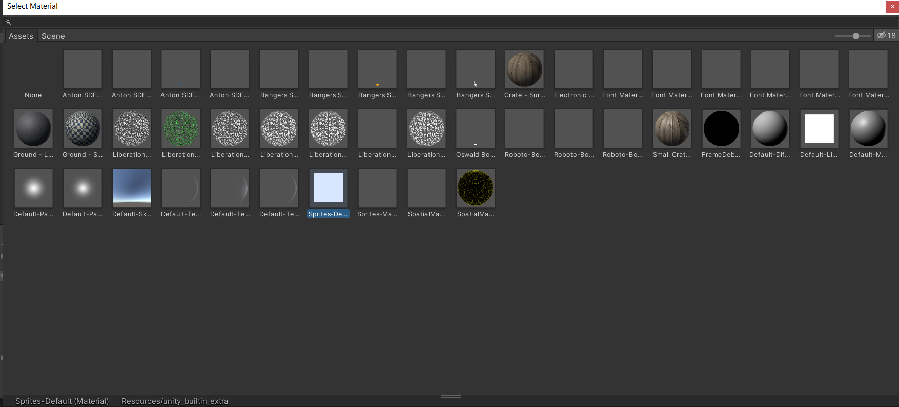
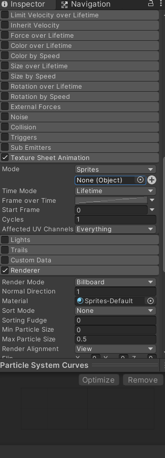
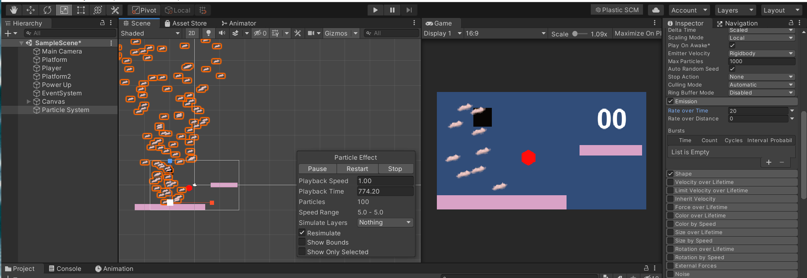

# How to use Particle Systems in Unity

- In the hierarchy window, **Right Click > Effects > Particle System**.
- By using the Move tool, you can move it anywhere in the scene you want to place it. You can Scale it, Rotate it, you can use almost all the tools according to the game requirement.
- In the Inspector Window, you can see the Particle System component. Play around with all the values to get your hands dirty.
- If you want to make your own particle effects, you have to use some other third-party tools like photoshop, ms paint to make the sprite, and then import it in Unity.

To import, in the Particle System component in the Inspector, go to **Renderer > Material.**

Select the Sprite Default Material
        

        
    
Then, select **Texture Sheet Animation.** Change the **Mode** from **Grid to Sprites.**

After that, click “None (Object)” below the Mode. Select the sprite that you have created or imported in Unity and you’re good to go.
        

        

Let's try to understand some of the properties or modules of Particle system here:

## Color by speed

This is the color gradient of a particle defined over a speed range with low and high ends.

## Color over Lifetime

This module specifies how a particle's color and transparency changes over lifetime.

## Size Over Lifetime

Particles can also be made to change their sizes according to a curve, this can be set using this module.

## Size by Speed

This module can be used to define a curve to set the particle's size over a speed range with low and high ends.

## Emission

This module is used to set the rate and timing of the Particle System Emissions. The Rate Over time is the number of particles emitted per unit of time and the Rate Over Distance is the number of particles emitted per unit of distance moved. Example, a steam train chimney that produces puffs of smoke.

You can find more detailed information on each module in the Unity API Reference Documentation here - [Unity Reference Docs](https://docs.unity3d.com/Manual/PartSysReference.html)
