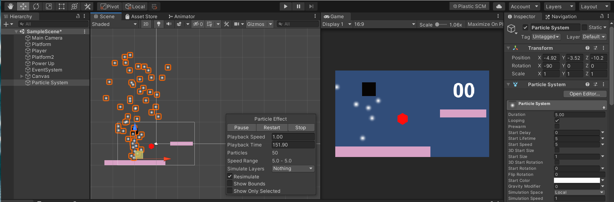
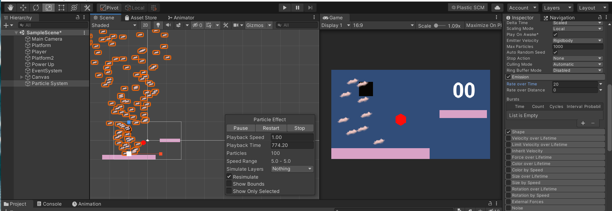

# Unity Particle Effects 2D

Particle effects are nothing but just like the phrase that says, *the* *cherry on the cake*. It can make the whole game beautiful, much more appealing, and can grab the player's attention towards the game for a long time. 

Unity makes it easier to put particles everywhere in the game. Pick up any game object that you want to put particles, apply to it, and booommmm!!! It will look amazing. Although applying too much of particles makes it look weird. There’s a saying “Don’t Over Do It”, and you have to carry that line along with you while using particles. 

**So let’s know what is a Particle System in Unity?**

- The Particle System releases a large number of particles randomly, for a certain period of time. The particles are then get destroyed when their period ends. You can consider particles as if they have a lifespan. The particles are no more in the scene when their lifespan ends.
- The system also comes with some predefined particle shapes like cones or spheres.
    
    

        
    

### How to use particle systems in Unity?

- In the hierarchy window, **Right Click > Effects > Particle System**.
- By using the Move tool, you can move it anywhere in the scene you want to place it. You can Scale it, Rotate it, you can use almost all the tools according to the game requirement.
- In the Inspector Window, you can see the Particle System component. Play around with all the values to get your hands dirty.
- If you want to make your own particle effects, you have to use some other third-party tools like photoshop, ms paint to make the sprite, and then import it in Unity.
    - To import, in the Particle System component in the Inspector, go to **Renderer > Material.**
    - Select the Sprite Default Material
        
        

            
        

        
    
    - Then, select **Texture Sheet Animation.** Change the **Mode** from **Grid to Sprites.**
    - After that, click “None (Object)” below the Mode. Select the sprite that you have created or imported in Unity and you’re good to go.
        

        

            
        

        
        Sample Image:
        

            
        

---

---

<aside>

> 💡 🚀 **[Join Discord Server](https://discord.gg/J5zDscnzms) → Get your doubts solved by experts instantly**

</aside>

---
